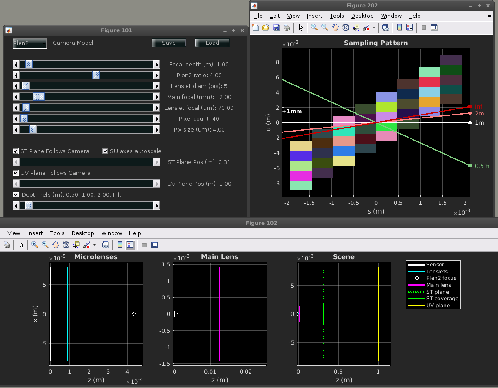

# LFCamExplore
A MATLAB tool for building intuition in the design space of plenoptic cameras 
Copyright (c) 2017-2021 by Donald G. Dansereau

# Quick start
Requires the Light Field Toolbox for MATLAB v0.5 available here: https://github.com/doda42/LFToolbox

Run LFCamExploreGUI.m.

For further information please see the main documentation file LFCamExplore.pdf.
 
